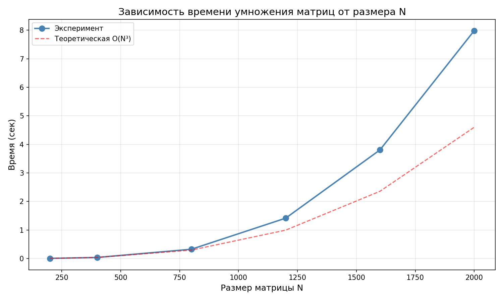

# Лабораторная работа №1

## Перемножение квадратных матриц

### Описание
Программа на C++ умножает две квадратные матрицы, считывая их из файлов, и сохраняет результат в файл.

### Автор
Суровцев Илья Курс: Параллельное программирование 

### Структура проекта
```text
Параллельное программирование/
├── lab1/
│   ├── src/
│   │   └── main.cpp                  ← код алгоритма
│   ├── input/                        ← входные матрицы
│   │   ├── matrix_a.txt
│   │   └── matrix_b.txt
│   └── output/                       ← результаты вычислений
│       ├── result.txt                ← итоговая матрица C
│       ├── info.txt                  ← время и объём текущего запуска
│       ├── experiments.txt           ← итоговый отчет серии тестов
│       └── graph.png                 ← график производительности
├── .gitignore                        
├── generate_matrix.py                ← генератор исходных матриц
├── verify.py                         ← верификация
├── experiments.py                    ← запуск тестов
├── plot_graphs.py                    ← построение графиков
└── README.md                         ← отчет
```

### Верификация

```text
========== ВЕРИФИКАЦИЯ ==========
Размер матриц: 200x200
Максимальная ошибка: 0.00000000001
ВЕРИФИКАЦИЯ ПРОЙДЕНА!
```

### Результаты экспериментов

| Размер | Время (сек) | Объём задачи (N³) |
| :---: | :---: | :---: |
| **200** | 0.0613 | 8 000 000 |
| **400** | 0.5809 | 64 000 000 |
| **800** | 6.4368 | 512 000 000 |
| **1200** | 14.7197 | 1 728 000 000 |
| **1600** | 35.4591 | 4 096 000 000 |
| **2000** | 69.0915 | 8 000 000 000 |

### График производительности


